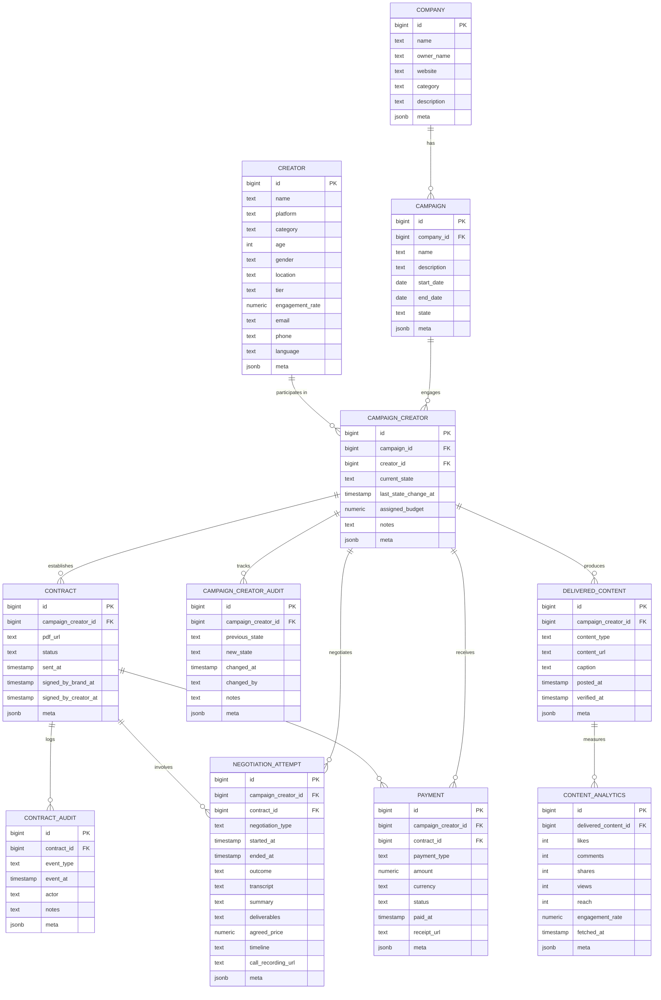

# Entity Relationship Diagram

This diagram represents the database schema for the influencer marketing platform.

## Relationship Descriptions

- A **Company** can have multiple **Campaigns**
- A **Campaign** can engage multiple **Creators** through **Campaign_Creator** association
- A **Creator** can participate in multiple **Campaigns** through **Campaign_Creator** association
- A **Campaign_Creator** relationship establishes **Contracts**
- **Contract** changes are logged in **Contract_Audit**
- **Campaign_Creator** state changes are tracked in **Campaign_Creator_Audit**
- **Campaign_Creator** relationships involve **Negotiation_Attempts** which may be linked to a **Contract**
- **Campaign_Creator** relationships result in **Delivered_Content**
- **Delivered_Content** performance is measured through **Content_Analytics**
- **Payments** are made to **Campaign_Creator** relationships based on **Contracts**
